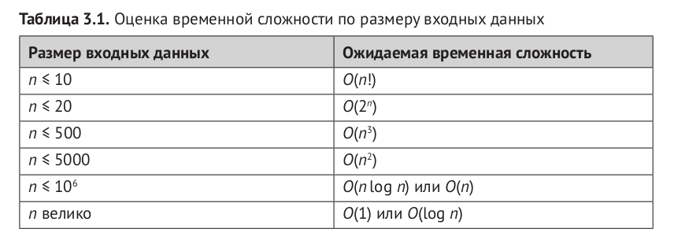

### Различные алгоритмы для личного пользования

for speed:  
g++ a.cpp -o a -std=c++17 -Wshadow -Wall -O2 -Wno-unused-result
  
for test:  
g++ a.cpp -o a -std=c++17 -Wshadow -Wall -g -fsanitize=address -fsanitize=undefined -D_GLIBCXX_DEBUG

