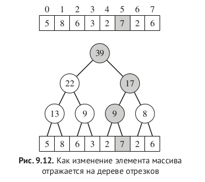
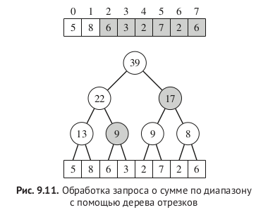
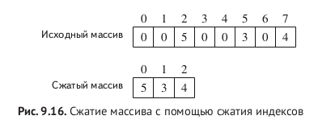
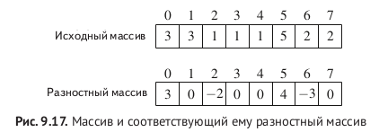
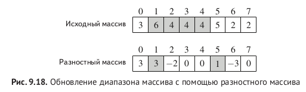

### Segment tree -- дерево отрезков




#### Дополнительные приемы:


##### Compressed array

```c++
c(2) = 0, c(5) = 1, c(7) = 2
Строим дерево отрезков сжатого массива
делаем запросы по сжатым индексам [c(a), c(b)]
```



##### Difference array

-- Обновить диапазон и извлечь одно значение

```c++
Разностный массив - массив, в котором хранится разница между соседними элементами.
Массив префиксных сумм разностного массива = исходный массив.
```


