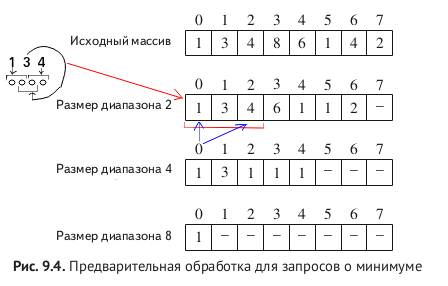
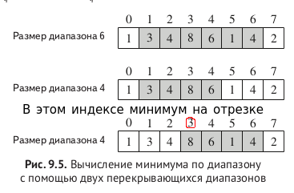

### Sparse table -- алгоритм разряженной таблицы

Prepossessing: O(n * logn)  
Get min: O(1)
```c++
mn(a, b) = min( mn(a, a + w - 1), mn(a + w, b)),
где b - a + 1 -- степень двойки, а w = (b - a + 1)/2.
```  




```c++
mn(a, b) = min( mn(a, a + k - 1), mn(b - k + 1, b)),
Пусть k -- наибольшая
степень двойки, не превосходящая b - a + 1.
```  


