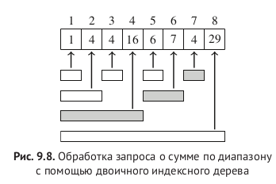
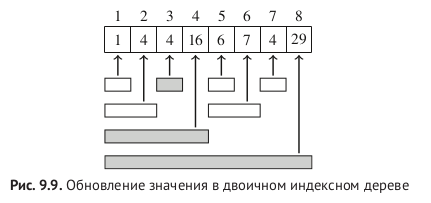

### Fenwick tree

upd: O(logn)  
sum/min: O(logn)  
memory: n

```c++
p(k) = k & -k
Выделяет младший единичный бит

6 & -6 = 2

-число в двоичном представлении = инвертирование битов + 1
```






