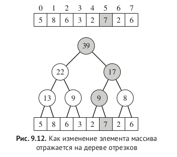
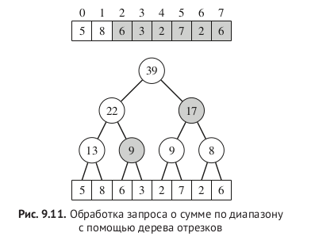
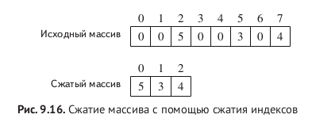
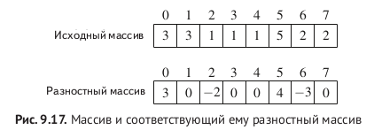
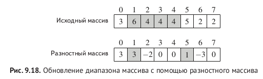

### Segment tree -- дерево отрезков

upd: O(logn)
sum/min/etc: O(logn)
memory: 4n




#### Дополнительные приемы:


##### Compressed array

```c++
c(2) = 0, c(5) = 1, c(7) = 2
Строим дерево отрезков сжатого массива
делаем запросы по сжатым индексам [c(a), c(b)]
```



##### Difference array

-- Обновить диапазон и извлечь одно значение

```c++
Разностный массив - массив, в котором хранится разница между соседними элементами.
Массив префиксных сумм разностного массива = исходный массив.
```



```c++
void upd_range(ll a, ll b, ll u) {
    add(a, u);
    add(b + 1, -u);
}

void get_point(ll a){
    sum(0, a)
}
```




##### Max subarray

prefix -- suffix approach 