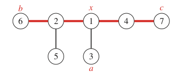

#### Tree diameter

Диаметром дерева называется максимальная длина пути между двумя
его вершинами

```c++
Сначала выберем в дереве произвольную вершину a и найдем вершину b,
самую далекую от a. Затем найдем вершину c, самую далекую от b.
Диаметр дерева равен расстоянию между b и c.
```
