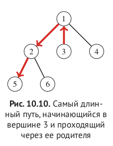
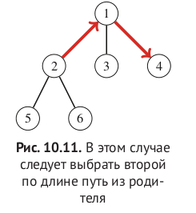

#### Максимальная длина пути начинающаяся в x.

```c++
1)
vec<ll> down1;
vec<ll> down2;

Вычислим 1ую и 2ую максимальные длины(level), идующие через нижнее ребро от x.
Причем первая и вторая максимальная длина должны начинаться в разных узлах.
down1[x] = mx1
down2[x] = mx2
mx1_fst_child != mx2_fst_child

2)
vec<ll> up 

Вычислим максимальную длину идущую через верхнее ребро.
рассмотрим два случая: если
путь, соответствующий down1[p], проходит
через x, то длина максимального пути равна
max(up[p], down2[p] + 1), в противном случае длина
максимального пути вверх равна max(up[p], down1[p] + 1).

ans[x] = max(down1[x], up[x])
```


